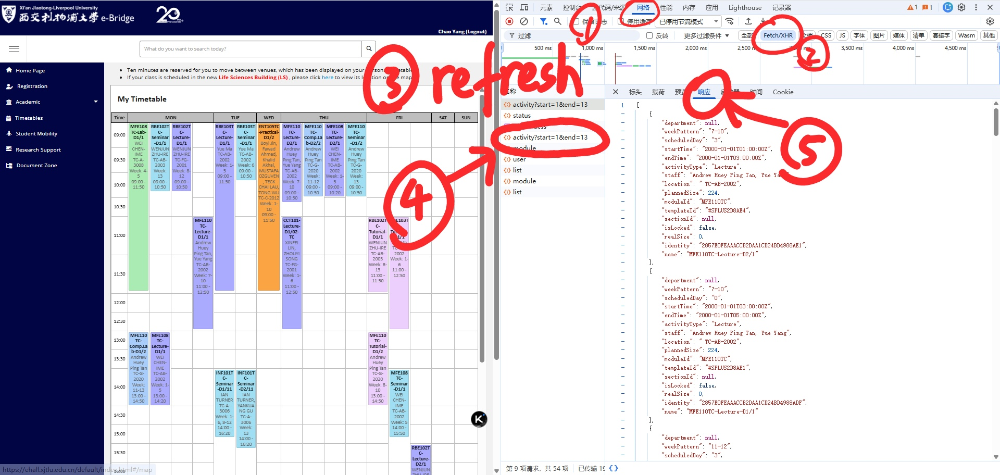
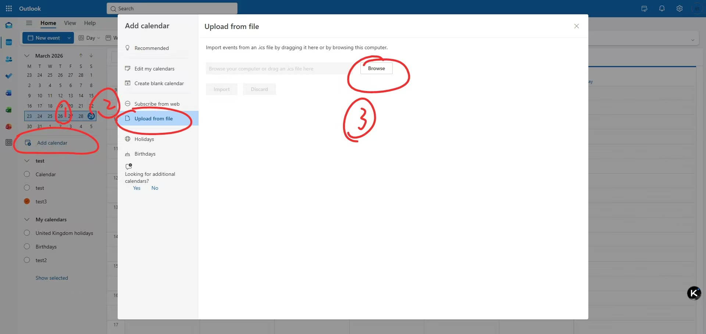
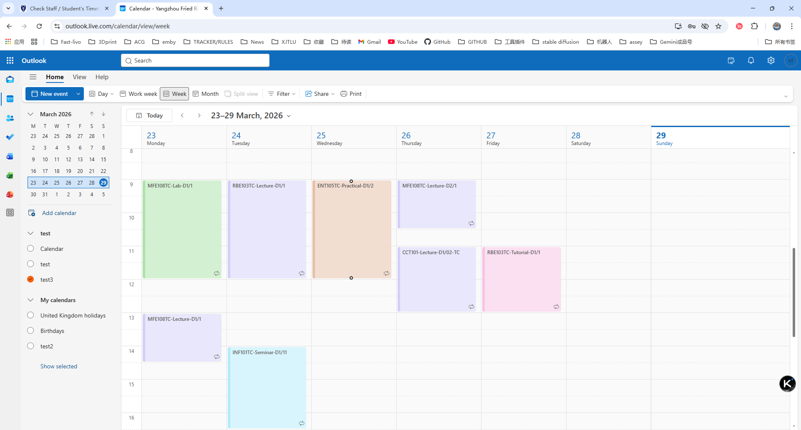

# 课表 JSON 转 Outlook ICS 转换器

[**English**](./README.md) | [**中文简体**](./README_zh.md)

这是一个轻量级的 Python 工具，旨在将你的大学课表（JSON 格式）自动转换为极其适配 Microsoft Outlook 的标准 `.ics` 日历文件。

## ✨ 特性
* **完美支持 Outlook Series (系列功能)**: 自动解析连续周模式（例如 "1-6" 周），并在 Outlook 中创建原生的循环系列事件 (Recurring Series)。
* **自带日历颜色分类**: 智能匹配课程类型，并利用 Outlook 的内置颜色进行双重标签绑定（例如自动将 `Lecture` 映射为 `Purple Category`）。让你的日历导入后瞬间变整洁！
* **丰富的课程详情**: 自动将任课教师、周数安排以及星期几写入到日历事件详情描述中。
* **严格的 UTC 时区转换**: 自动处理原始数据中带 `Z` (UTC) 的时间数据，由你的系统自动适应时区展示。
* **自定义开学日期**: 每次执行时会提示你输入本学期的第一天（"第一周的星期一"），一键完成所有日期的偏移与计算。

---

## 🚀 快速上手

### 1. 前置条件
请确保你已经安装了 Python。并在终端运行以下命令以安装必须的 `icalendar` 依赖库：
```bash
pip install icalendar
```

### 2. 准备你的数据
1. 打开网页进入 E-Bridge 课表界面。
2. 按 `F12` 打开浏览器开发者工具（以 Chrome 为例）。
3. 切换到 **Network (网络)** 标签，筛选 Fetch/XHR，按如下图所示找到返回课表数据的指定请求：
   
   

4. 复制该请求全部的原始 JSON 响应代码。
5. 将复制的内容粘贴并替换当前文件夹下 `time.json` 中的所有内容。

### 3. 运行转换脚本
打开你的终端并执行：
```bash
python main.py
```

### 4. 输入开学日期
程序将会在终端中提示你输入当前学期第一周星期一的日期：
```text
=== JSON to Outlook ICS Schedule Converter ===
📅 请输入[第一周星期一]的日期 (格式如 2024-02-26): 2024-03-04
```
按照 `YYYY-MM-DD` 格式输入，按下 **回车键**。

### 5. 导入 Outlook
该脚本会在同目录下瞬间生成一个 `schedule.ics` 文件。您可以通过以下两种方式之导入：

**方式一：使用 Outlook 桌面端**
双击它使用 Microsoft Outlook 打开，或者直接将文件**拖拽**到你的 Outlook 日历界面中即可大功告成！

**方式二：使用 Outlook 网页端**
1. 访问 [Outlook 网页版日历](https://outlook.live.com/calendar/view/week)。
2. 在左侧面板中点击 **添加日历 (Add calendar)**。
3. 选择 **从文件上传 (Upload from file)**，点击 **浏览 (Browse)** 选中刚才生成的 `schedule.ics` 文件。
4. 选择你要导入的目标日历，最后点击 **导入 (Import)**。




---

## 📅 颜色映射逻辑
工具将遵循以下逻辑按顺序插入双标签（颜色标签 + 分类标签）以使得 Outlook 日历自动亮起颜色：
- **Lecture** $\rightarrow$ `Purple Category` & `Lecture`
- **Lab** $\rightarrow$ `Green Category` & `Lab`
- **Seminar** $\rightarrow$ `Blue Category` & `Seminar`
- **Comp.Lab** $\rightarrow$ `Dark Blue Category` & `Comp.Lab`
- **Tutorial** $\rightarrow$ `Pink Category` & `Tutorial`
- **Practical** $\rightarrow$ `Orange Category` & `Practical`

---
